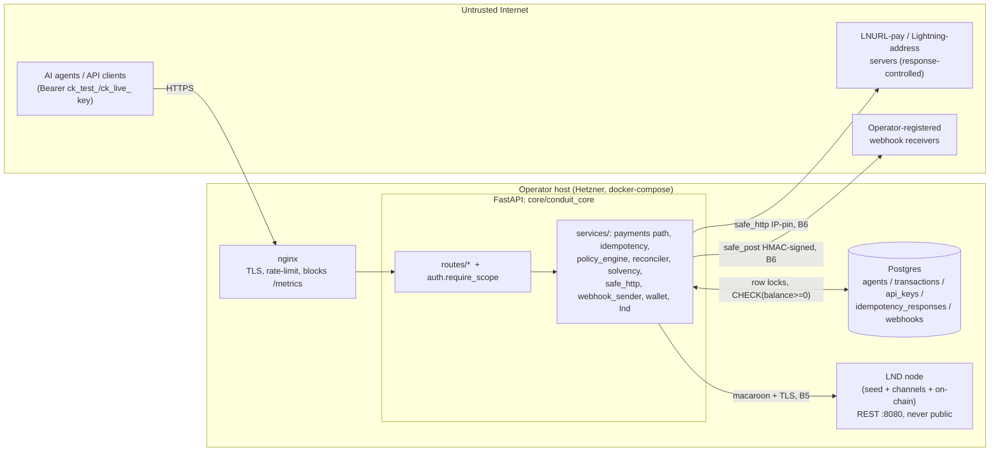

# Conduit Security Audit Preparation

> **Purpose.** Make Conduit *audit-ready* and give an external auditor everything
> they need to **scope and start** a review of the real-money code paths. This is a
> threat model plus an audit-prep package, grounded in the actual `core/conduit_core`
> codebase as shipped in **v0.8.1** (live on **testnet + regtest** at
> `api.conduit.energy`).
>
> **Honesty clause.** Conduit has an in-house red-team suite (the `core/tests`
> security tests, summarized below). That is **not** a substitute for an independent
> audit. An internal team that wrote the controls and the tests for those controls
> shares the same blind spots. Nothing here has been reviewed by an external firm,
> there is no legal/regulatory opinion, and **mainnet has never been exercised in
> production.** Treat this document as the scoping input to a real audit, not a
> certificate.

---

## 0. Status snapshot

| Item | State |
| --- | --- |
| Network | testnet + regtest only; **mainnet never run in production** |
| External security audit | **None** |
| Legal / regulatory / money-transmission opinion | **None** |
| In-house red-team | `core/tests/` security suite, all green in CI (see §4) |
| Custody model | **custodial at the agent layer**; operator holds the real keys/sats |
| Wallet key protection | OS file perms + optional plaintext unlock file; **no KMS/HSM** |
| DB high availability | single Postgres, no replica/HA |
| Authorization granularity | scope-based (`read`/`write`/`admin`), **no per-agent isolation** |

---

## 1. System overview & trust boundaries

Conduit is a single FastAPI app (`core/conduit_core`) sitting in front of **one** LND
node. Agents are virtual ledger rows (integer `balance_sats`), not Bitcoin keyholders.
The operator holds the real sats in their LND channels; agent balances are
operator-controlled IOUs (claims) against that one node's liquidity.

### Trust boundaries

| # | Boundary | Who/what crosses it | Trust assumption |
| - | --- | --- | --- |
| B1 | Internet → nginx edge | API clients / agents (scoped Bearer key) | Untrusted. TLS-terminated, rate-limited, `/metrics` returns 404 at edge (`infra/nginx/conduit.prod.conf`). |
| B2 | nginx → FastAPI (`api:8000`) | proxied HTTP | Same-host docker network; nginx is the only public ingress. |
| B3 | Agent key → API scope | `require_scope("read"/"write"/"admin")` (`auth.py`) | Scope is the **only** boundary. A key is **not** bound to an agent. |
| B4 | FastAPI → Postgres | SQLAlchemy async, row locks | DB is in-perimeter; integrity enforced by app logic **and** DB `CHECK`. |
| B5 | FastAPI → LND (REST :8080) | macaroon header + TLS cert pin (`services/lnd.py`) | LND gRPC/REST is **never** exposed publicly; only Conduit talks to it. |
| B6 | FastAPI → outbound HTTP (LNURL / webhooks) | `services/safe_http.py` IP-pinned fetch | Remote host **and response content** are attacker-influenced → SSRF-hostile. |
| B7 | Operator host / disk | LND seed, macaroon, TLS key, wallet-unlock file, `API_SECRET_KEY`, `BOOTSTRAP_API_KEY` | **Operator's responsibility** (per `SECURITY.md` "Out of scope"). Root on the box = wallet access. |

### Boundary diagram

The key architectural fact for an auditor: **Conduit is a single-operator tool.**
Scopes gate *capability* (read/write/admin), not *tenancy*. A `write` key can act on
**any** agent; a `read` key can read the **entire** fleet. Agents are an accounting +
policy unit, **not** a security boundary between mutually-distrusting parties. Hard
multi-tenant isolation is roadmap, not shipped (`Agent.api_key_id` is recorded for
provenance only; **no route filters on it** — see `routes/agents.py:create_agent`).

---

## 2. Assets to protect (ranked)

| Rank | Asset | Where it lives | Why it's ranked here | Compromise impact |
| --- | --- | --- | --- | --- |
| A1 | **LND wallet seed / on-chain & channel keys** | Operator host (`~/.lnd`), never in Conduit | Direct, irreversible control of *all* real sats | Total loss of node funds |
| A2 | **LND macaroon** (admin) | File mounted into the container, loaded by `_load_macaroon_hex` (`services/lnd.py`) | Lets the holder move funds via LND directly, bypassing the ledger/policy | Drain channels, bypass all Conduit controls |
| A3 | **Channel state / SCB** (`backup_channels.sh`) | LND data dir | Loss without SCB risks unrecoverable channel funds | Stuck/lost channel balances |
| A4 | **Ledger integrity** — no negative/forged balances | `agents.balance_sats`, `transactions` (Postgres) | The whole product is the ledger; a forged credit is an unbacked mint | Insolvency, theft of operator liquidity |
| A5 | **Agent funds / solvency** — Σ balances ≤ node liquidity | DB liabilities vs LND assets (`services/solvency.py`) | If liabilities exceed assets some agent cannot be paid out | Operator insolvency |
| A6 | **Idempotency / double-spend guarantee** | `idempotency_responses` unique `(api_key_id, key)` | A race or replay = paying twice for one authorization | Direct sats loss per incident |
| A7 | **API keys** (bcrypt-hashed) + bootstrap/admin key | `api_keys.key_hash`, `BOOTSTRAP_API_KEY` env | Bootstrap key is the operator's master key (admin scope) | Full fleet control, mint/credit/sweep |
| A8 | **`API_SECRET_KEY`** | env / config | Signs `X-Conduit-Server-Signature` on webhooks; prod sentinel | Webhook forgery; weakens integrity signal |
| A9 | **PII** | Minimal by design | Conduit stores no names/emails; agent `name`, `memo`, `metadata_json` are operator-supplied | Low — but operators may put PII in memo/metadata; treat as untrusted free text |

PII note for the auditor: the schema (`db/models.py`) deliberately has **no** end-user
PII columns. The only free-text fields (`memo`, `metadata_json`, agent `name`) are
operator/agent supplied. There is no email, KYC, or card data anywhere.

---

## 3. Threat model (attacker-goal framing, STRIDE-tagged)

Attacker profiles: **(P1)** an agent holding a legitimate `write` key (the primary
adversary — it can authorize payments); **(P2)** an unauthenticated internet attacker;
**(P3)** a malicious LNURL/webhook endpoint controlling outbound-HTTP responses;
**(P4)** an insider/compromised-host attacker (largely out of Conduit's scope but listed).

| ID | Attacker goal | STRIDE | Vector | Primary defense (file) |
| --- | --- | --- | --- | --- |
| T1 | **Double-spend via race** — fire N concurrent identical sends, get N payments for one balance | Tampering/Elevation | Concurrent POST `/v1/payments/send` | Debit-before-pending under `SELECT … FOR UPDATE` row lock (`routes/payments.py` Phase 1) |
| T2 | **Double-charge via retry** — network blip → SDK retries → second payment | Tampering | Same `Idempotency-Key` replay | Reservation insert on unique `(api_key_id,key)`; in-flight → 409, completed → cached (`services/idempotency.py`) |
| T3 | **Amount substitution** — pay a big invoice with a small budget | Tampering | Mismatch between `sats` and BOLT11/LNURL invoice amount | `_resolve_bolt11_amount` + LNURL amount re-check (`routes/payments.py`) |
| T4 | **Privilege escalation across scopes** — read key writes, write key does admin | Elevation | Calling higher-scope routes | `_SCOPE_RANK` ordering in `require_scope` (`auth.py`) |
| T5 | **Cross-agent / cross-tenant action** — act on an agent you didn't create | Elevation | Any valid key targeting any `agent_id` | **Not defended — by design (single-operator).** Documented limitation; per-agent authz is roadmap |
| T6 | **SSRF** — point the server at `169.254.169.254`/RFC1918/loopback via a Lightning address, LNURL callback, or webhook URL | Info disclosure / SSRF | `to=name@evil`, malicious `callback`, malicious webhook URL | `assert_safe_url` + `_PinnedTransport` IP allowlist (`is_global`), https-only, redirects off, body cap (`services/safe_http.py`) |
| T6a | **DNS-rebinding / TOCTOU** — flip A-record to private after the pre-check | SSRF | Low-TTL DNS | Connection **pinned** to the validated IP inside `handle_async_request`; no second lookup |
| T6b | **CGNAT/metadata bypass** of a denylist | SSRF | `100.64.0.0/10`, IPv4-mapped IPv6, dual-record hosts | Allowlist (`not ip.is_global`), unwrap `ipv4_mapped`, reject if **any** resolved IP unsafe |
| T7 | **Idempotency abuse** — reuse a key with a different body to get a stale/cached payout | Tampering | Key reuse with mismatched payload | Body hashed; mismatch → **409**, never serve wrong cached response (`services/idempotency.py`) |
| T8 | **Unbacked mint / insolvency** — credit beyond node liquidity | Tampering | Credit path, forged balance | Solvency monitor (`services/solvency.py`) + opt-in `enforce_solvent()` on the credit path; DB `CHECK(balance_sats>=0)` |
| T9 | **UNKNOWN-state double-spend** — LND HTTP call times out; refunding would let the agent spend twice | Tampering | LND timeout/5xx after submit | Phase 3c: **do not refund**, mark `needs_reconciliation`, reconciler resolves from LND `lookuppayment` (`routes/payments.py`, `services/reconciler.py`) |
| T10 | **Webhook signature forgery / replay** | Spoofing | Forged delivery to operator's receiver | HMAC `X-Conduit-Signature` (per-webhook secret) + `X-Conduit-Server-Signature` (`API_SECRET_KEY`), `ts` field (`services/webhook_sender.py`) |
| T11 | **LND key compromise** | Elevation | Host root, macaroon theft, plaintext unlock file | **Largely out of Conduit's control**; mitigations are operator host hardening (see §5 infra) |
| T12 | **Secret leakage** — bootstrap/admin key, `API_SECRET_KEY`, macaroon in repo/logs/CI | Info disclosure | Commit, log line, image | gitleaks (blocking), prod boot refuses dev defaults (`config.validate_for_runtime`), keys bcrypt-hashed, rate-limit key fragment redacted |
| T13 | **Supply-chain** — malicious/vulnerable dep or base image | Tampering | pip/npm transitive dep, Docker base | Dependabot (weekly), `pip-audit`/`npm audit` (advisory), pinned base — **no SBOM/signing yet** |
| T14 | **DoS / auth amplification** | DoS | Flood, or auth bcrypt-per-key O(N) | Token-bucket limiter (`middleware.py`), 16-char prefix narrows bcrypt candidates to O(1) (`auth.py`) |
| T15 | **CORS / token exfiltration to a rogue origin** | Info disclosure | Browser cross-origin | Explicit allowlist; empty list = same-origin only; credentials only when origins set (`main.py`) |
| T16 | **Negative-balance / direct-write corruption** | Tampering | Bug or direct DB write | `CheckConstraint("balance_sats >= 0")` enforced by SQLite **and** Postgres (`db/models.py`, alembic 0006) |
| T17 | **Info leak via errors** | Info disclosure | Trigger a 500 | Generic catch-all handler; internals logged, not returned (`main.py`) |
| T18 | **Policy bypass** — exceed per-tx/hour/day/rate limits | Elevation | Crafted payments | `PolicyEngine`, **fail-closed** on any evaluation error (`services/policy_engine.py`) |

### Known, accepted limitations the auditor should focus on (not "findings" — disclosed)

- **T5 — no per-agent isolation.** Any valid key acts on the whole fleet. Documented;
  hard isolation requires a separate instance per tenant. The auditor should confirm
  there is no *unintended* escalation **within** the scope model (T4), and assess
  whether the single-operator framing is consistently enforced.
- **Multi-worker rate limiter (T14).** `TokenBucket` is in-process per uvicorn worker
  (`middleware.py`); multi-worker divides the effective limit. Current prod runs a
  single api container. Verify deployment matches the assumption, or that nginx
  `limit_req` fronts it.
- **Solvency enforcement is opt-in** (`SOLVENCY_ENFORCE=false` default). Default is
  observe-and-warn so turning the monitor on never breaks a live deployment by
  surprise. The auditor should evaluate whether the *default* is appropriate for a
  custodial system and whether enforcement gates **every** money-in path (today it
  gates `credit_agent`; the invoice settlement watcher also credits).
- **Plaintext wallet-unlock file** (`infra/scripts/setup_wallet_unlock.sh`) — a stated
  tradeoff (0600, root-on-box = wallet access). No KMS/HSM.

---

## 4. Existing mitigations & what the in-house red-team covers

Each control maps to real code and to the test that exercises it. Test counts are from
the `core/tests` suite (≈121 test functions total; security-relevant subset below).

| Threat | Control (file) | Red-team coverage (test) |
| --- | --- | --- |
| T1 double-spend race | Row-locked debit-before-pending (`routes/payments.py`) | `test_idempotency.py::test_concurrent_same_key_executes_once`; `test_payment_safety.py` |
| T2/T7 idempotency | Reservation on unique `(api_key_id,key)`, body-hash conflict → 409 (`services/idempotency.py`) | `test_idempotency.py` (6 tests: cached, 409-on-different-body, failure cached, scoped-to-key, concurrent-once) |
| T3 amount substitution | `_resolve_bolt11_amount`, LNURL amount re-check (`routes/payments.py`) | `test_payment_safety.py::test_bolt11_smaller_sats_is_rejected`, `::test_lnurl_pay_overcharge_is_rejected` |
| T4 scope escalation | `_SCOPE_RANK` in `require_scope` (`auth.py`) | `test_api.py`, `test_api_keys_revoke.py` |
| T6/T6a/T6b SSRF | `assert_safe_url` + `_PinnedTransport` allowlist (`services/safe_http.py`) | `test_ssrf.py` (19 tests: metadata IP, CGNAT, dual-record, rebinding-flip-refused, pin-to-validated-IP, cross-domain callback) |
| T8/T16 solvency & non-negative | `solvency.py` monitor + `enforce_solvent()`; DB `CHECK` | `test_solvency.py` (19 tests: insolvent detect, pending-not-double-counted, LND-error-conservative, enforce on/off, negative-write-rejected) |
| T9 UNKNOWN state | Phase 3c no-refund + reconciler (`reconciler.py`) | `test_payment_safety.py::test_lnd_error_leaves_pending_no_refund`; `test_reconciler.py` (6 tests) |
| T10 webhook signing | HMAC dual-signature (`webhook_sender.py`) | `test_webhook_faf.py` (3 tests, fire-and-forget) |
| T14 auth amplification / DoS | Prefix-narrowed bcrypt, token bucket | `test_v07_hardening.py`, `test_high_fixes.py` |
| T17 error leak | Generic 500 handler (`main.py`) | `test_high_fixes.py`, `test_api.py` |
| T18 policy fail-closed | `PolicyEngine.evaluate` try/except → deny (`policy_engine.py`) | `test_policy_engine.py` (11 tests) |
| Platform fee accounting | `compute_platform_fee`, refund-on-fail (`services/fees.py`) | `test_platform_fees.py` (11 tests) |
| Inbound invoice settlement | `InvoiceWatcher` (`services/invoice_watcher.py`) | `test_invoice_watcher.py` (4 tests) |
| Observability integrity | `/metrics` no-auth-by-design, edge-blocked (`main.py`, nginx) | `test_metrics.py`, `test_solvency.py` prometheus tests |

**CI gates (`.github/workflows/ci.yml`):** ruff lint, pytest on **both SQLite and real
Postgres 16** (catches the tz-aware/-naive class of bug SQLite hides), alembic
`upgrade head` + `check` (migrations match models), gitleaks (**blocking**),
`pip-audit`/`npm audit` (advisory), Python 3.12/3.13 + Node 20/22 matrices.

> **Caveat the auditor must internalize:** these tests were written by the same people
> who wrote the controls. They prove the controls behave as *intended*; they do not
> prove the *intent* is complete. Adversarial, assumption-breaking review is exactly
> what the external audit is for.

---

## 5. Audit scope recommendation

### Priority 1 — money-movement code paths (highest sats-at-risk)

| Path | Files | What to scrutinize |
| --- | --- | --- |
| Payment state machine | `routes/payments.py` | Phase 1 lock/debit, Phase 3a refund, **Phase 3c UNKNOWN no-refund**, fee-budget reconciliation, every `rollback()` path; re-check-under-lock vs reconciler |
| Idempotency | `services/idempotency.py` | Reservation atomicity, the "vanished record → treat as in-progress" branch, finalize-on-exception, `_PENDING` sentinel collisions |
| Reconciler | `services/reconciler.py` | Double-apply protection (`refresh` under lock), IN_FLIGHT/UNKNOWN handling, skip-on-missing-hash leak |
| Solvency | `services/solvency.py` | Liability/asset definitions, pending-outbound double-count reasoning, LND-error → conservative `solvent=False`, enforcement coverage of **all** money-in paths |
| Policy engine | `services/policy_engine.py` | Fail-closed guarantee, window-sum SQL (pending+settled counted), allowlist/blocklist normalization |
| Ledger ops | `services/ledger.py`, `routes/agents.py` | credit/debit, `CHECK` reliance, solvency gate placement |

### Priority 2 — auth, authz, SSRF, secrets

- `auth.py` — bcrypt verify, prefix narrowing, bootstrap-key install, scope enforcement.
- `services/safe_http.py` + `services/wallet.py` — the **entire** SSRF surface: IP
  allowlist, pinning transport, redirect/​body limits, registrable-domain
  callback check; confirm **all** outbound HTTP routes through `safe_http`.
- `config.py` — `validate_for_runtime` prod safety gate; default-secret sentinels.
- `middleware.py` — rate-limit identity (XFF right-most trust), CORS in `main.py`.

### Priority 3 — infra / custody / supply-chain

- **LND key handling** — `services/lnd.py` (`_load_macaroon_hex`, `_load_tls_context`,
  TLS verify), and `infra/`: `lnd*.conf.example`, `setup_wallet_unlock.sh`
  (plaintext-file tradeoff), `setup_firewall.sh`, `docker-compose.prod.yml`, nginx
  confs (LND never public, `/metrics` 404 at edge, security headers).
- **Secrets & deploy** — env handling, `BOOTSTRAP_API_KEY`/`API_SECRET_KEY` lifecycle,
  `infra/scripts/deploy.sh`, backup scripts (`backup_channels.sh`, `backup_postgres*`).
- **Supply-chain** — `core/pyproject.toml`, `sdk-*/`, `dashboard/`, `core/Dockerfile`,
  Dependabot config; recommend adding SBOM + image signing (see §7 gaps).

### Explicitly in/out of audit scope

- **In:** `core/` (auth, ledger, payment phases, reconciliation, solvency, SSRF, admin
  routes), official SDKs (`sdk-python/`, `sdk-js/`), MCP server (`mcp-server/`).
- **Out (operator responsibility, per `SECURITY.md`):** the operator's host hardening,
  OS/network config, their LND node, macaroons, TLS material, wallet seed, and any
  keys/secrets they manage. The auditor should still **review the guidance** Conduit
  ships for these, even if the running host is out of scope.

---

## 6. Audit-readiness checklist (hand-off package)

Provide the auditor with all of the following before kickoff:

- [ ] **Architecture overview** — this document §1, plus `README.md` (self-hosted trust
      model, authorization model) and `Conduit_Whitepaper_v1.pdf`.
- [ ] **This threat model** (`docs/SECURITY_AUDIT_PREP.md`) — assets, threats, mitigations.
- [ ] **Prior red-team results** — the `core/tests` security suite + how to run it
      (`cd core && pytest -q`); CI config (`.github/workflows/ci.yml`).
- [ ] **Test suite + coverage** — coverage is configured (`coverage` in `.venv`);
      generate `pytest --cov=conduit_core --cov-report=term-missing` and hand over the
      report. Flag any money-path lines below target.
- [ ] **`SECURITY.md`** — disclosure policy, scope, the explicit testnet/no-audit caveat.
- [ ] **Deploy / infra docs** — `infra/README.md` (security checklist), `infra/nginx/*`,
      `docker-compose.prod.yml`, `infra/scripts/*`, `infra/lnd/*.conf.example`.
- [ ] **Data model** — `core/conduit_core/db/models.py` + `core/alembic/` migration
      history (esp. alembic 0006 for the `balance_sats >= 0` CHECK).
- [ ] **A staging environment** — a regtest/testnet bring-up the auditor can fuzz/exploit
      freely. **Do not** point them at the public `api.conduit.energy` (per `SECURITY.md`,
      no scans against the live testnet). Provide `LND_MOCK=true` for fast logic review
      and a regtest node for end-to-end.
- [ ] **Threat-model walkthrough session** — a live call covering §3 and the three
      "accepted limitations," so the auditor spends budget on the unknowns, not the knowns.
- [ ] **Secrets-handling brief** — confirm no live secrets in repo (gitleaks history
      scan), and the env-var lifecycle for `BOOTSTRAP_API_KEY` / `API_SECRET_KEY` / macaroon.

---

## 7. Self-assessment vs a recognized baseline

Mapped to **OWASP ASVS**-style categories plus crypto-custody best practice. Honest
status: `Met` / `Partial` / `Gap` / `N/A`.

| Category | Conduit control | Status | Notes / gap |
| --- | --- | --- | --- |
| **V2 Authentication** | bcrypt(rounds=12) hashed keys, shown once, prefix-narrowed verify (`auth.py`) | Met | No key rotation/expiry workflow; no MFA on the operator key (it's a bearer secret) |
| **V3 Session mgmt** | Stateless bearer keys; no cookies/sessions | N/A | API-key model, not sessions |
| **V4 Access control** | Scope ranks `read<write<admin` (`auth.py`) | **Partial** | **No per-agent/tenant isolation (T5)** — by design, single-operator. Functional escalation **within** scopes is defended |
| **V5 Validation / injection** | Pydantic schemas (`schemas.py`); SQLAlchemy params; amount re-checks | Met | Free-text `memo`/`metadata` stored raw — operators must treat as untrusted on render |
| **V5.x SSRF** | `safe_http` allowlist + IP pinning + redirect/body caps; registrable-domain callback check | Met (strong) | One of the better-developed areas; 19 SSRF tests. Verify **all** egress routes through it |
| **V7 Error handling / logging** | Generic 500s, structlog JSON, request-id correlation, key-fragment redaction | Met | Confirm no sensitive value reaches logs at higher verbosity |
| **V8 Data protection** | Minimal PII; secrets bcrypt-hashed; webhook secrets stored | Partial | Webhook `secret` and `API_SECRET_KEY` stored at rest unencrypted (DB/env); no field-level encryption |
| **V9 Communications** | HTTPS at edge; LND TLS-verified; webhooks HTTPS-only | Met | Cert pinning to LND via cafile; verify TLS settings |
| **V11 Business logic** | Row-locked debit-before-pending, idempotency, UNKNOWN-no-refund, fail-closed policy | Met (core strength) | The crown jewels; deserves the deepest external review |
| **V12 Files / resources** | Response body cap (5 MiB) on outbound fetches | Met | — |
| **V13 API** | Rate limiting, CORS allowlist, scoped routes | Partial | Rate limiter per-worker (T14); fine for single-worker prod, document the constraint |
| **V14 Config** | Prod boot refuses dev defaults & SQLite; gitleaks; Dependabot | Met | — |
| **Custody: key storage** | OS perms; optional plaintext unlock file | **Gap** | **No KMS/HSM**; root-on-box = wallet. Stated tradeoff |
| **Custody: solvency proof** | Monitor liabilities vs assets; opt-in enforce | Partial | Enforcement **off by default**; not a cryptographic proof-of-reserves |
| **Custody: key ceremony / backup** | SCB backup script; seed never on box by Conduit | Partial | No documented multi-party key ceremony; single-node, single-operator |
| **Supply chain** | Dependabot, pip-audit/npm audit (advisory), pinned base | Partial | **No SBOM, no image signing, no reproducible build, no dep pinning by hash** |
| **Resilience / HA** | Single Postgres, single api container, backups + reconciler | Gap | No DB replica/HA; recovery relies on backups + reconciler |
| **Independent assurance** | In-house red-team only | **Gap** | **No external audit; no legal/MTL opinion; mainnet unproven** |

---

## 8. Candidate audit firms & how to scope the RFP

Conduit needs a firm comfortable with **both** (a) web-app / backend security
(FastAPI, Postgres, auth, SSRF, business logic) **and** (b) Bitcoin/Lightning + custody
(LND, macaroons, channel/key handling, solvency/custody design). Few firms are
genuinely strong at both, so consider one web-app firm **plus** one Bitcoin/Lightning
specialist, or a firm with a dedicated Bitcoin practice.

### Reputable candidates (representative, not endorsements — vet current rosters)

**Bitcoin / Lightning / custody specialists**

- **Trail of Bits** — deep crypto + appsec, has reviewed Bitcoin/Lightning and wallet systems.
- **NCC Group** (incl. its Cryptography Services practice) — broad appsec with crypto depth.
- **Kudelski Security** — applied cryptography and blockchain custody reviews.
- **Coinspect** — Bitcoin-focused security firm (wallets, exchanges, custody).
- **Cure53** — high-signal code/appsec audits; strong on web + protocol review.

**Web-app / backend / supply-chain depth**

- **Doyensec** — application security, API and backend specialists.
- **Include Security** — practical appsec and code review.
- **Latacora** / **Atredis Partners** — appsec and infrastructure review.

**Lightning-ecosystem awareness** — if budget allows, engage a reviewer with direct
**LND** operational expertise (the Lightning Labs ecosystem / independent LN engineers)
for the node-custody and channel-state portions specifically.

### How to scope the RFP

1. **Objective.** "Independent security audit of Conduit v0.8.x ahead of a mainnet,
   custodial deployment. Primary concern: irreversible loss of real sats via the
   money-movement paths and custody of LND keys."
2. **Scope in.** `core/` (auth, ledger, payment phases, reconciler, solvency, SSRF,
   admin routes), `sdk-python/`, `sdk-js/`, `mcp-server/`, `infra/` custody/deploy
   guidance, dependency/supply-chain.
3. **Scope out.** The operator's running host/OS/network (note it, but it's
   operator-owned per `SECURITY.md`). Be explicit so it's not mistaken for an oversight.
4. **Method.** Manual code review of the Priority-1 paths (§5) + threat-model-led
   testing against a provided regtest/testnet staging env. Specifically request
   adversarial probing of: double-spend races (T1), UNKNOWN-state handling (T9),
   idempotency edge cases (T2/T7), SSRF (T6), and the solvency/custody model (T8/T11).
5. **Deliverables.** Findings report with severities + reproductions, a remediation
   call, and a **fix-verification re-test**. Ask for a public summary suitable for the
   launch.
6. **Inputs you provide.** The §6 hand-off package + a threat-model walkthrough.
7. **Constraints.** No testing against the public `api.conduit.energy`; reproduce on
   the provided regtest/testnet. Coordinated disclosure per `SECURITY.md`.
8. **Pre-conditions to set internally before kickoff** (so audit budget isn't spent on
   known gaps): land an SBOM + image signing, document the rate-limiter deployment
   assumption, and decide the `SOLVENCY_ENFORCE` default policy for mainnet.

---

## 9. Findings & remediation tracking template

Use one row per finding. `ID` format `CDT-AUD-NNN`. Severity via CVSS-style or
Critical/High/Medium/Low/Info. "Money-at-risk?" flags findings that can move real sats.

| ID | Title | Severity | Money-at-risk? | Component (file) | Threat ref (§3) | Status | Owner | Reported | Fix commit / PR | Re-test verdict |
| --- | --- | --- | --- | --- | --- | --- | --- | --- | --- | --- |
| CDT-AUD-001 | _e.g._ Refund applied on ambiguous LND error | Critical | Yes | `routes/payments.py` | T9 | Open | | | | |
| CDT-AUD-002 | | | | | | Triaging | | | | |
| CDT-AUD-003 | | | | | | Fixed | | | | Verified |
| CDT-AUD-004 | | | | | | Won't-fix (accepted risk) | | | | N/A |

**Status values:** `Open` → `Triaging` → `In progress` → `Fixed` → `Verified`
(re-tested by auditor) → `Closed`. Plus `Won't-fix (accepted risk)` with a written
rationale and sign-off, and `Disputed`.

**Per-finding record (attach for each row):**

- [ ] Description, impact, and a concrete reproduction (regtest/testnet PoC preferred).
- [ ] Affected component + commit/version.
- [ ] Proposed remediation and a **regression test** added under `core/tests/`.
- [ ] Re-test by the auditor; link the verifying commit/PR.
- [ ] For accepted risks: documented rationale, sign-off, and a `SECURITY.md` /
      release-notes disclosure if user-facing.

**Definition of done for the audit engagement:** every Critical/High either `Verified`
or `Won't-fix` with explicit sign-off; a regression test exists for each fixed
money-path finding; and the public summary is agreed for the launch.

---

### Appendix — quick file index for the auditor

| Concern | File |
| --- | --- |
| Payment phases / debit-before-pending | `core/conduit_core/routes/payments.py` |
| Idempotency reservation | `core/conduit_core/services/idempotency.py` |
| Pending-payment reconciler | `core/conduit_core/services/reconciler.py` |
| Solvency monitor + enforce | `core/conduit_core/services/solvency.py` |
| SSRF-safe outbound HTTP | `core/conduit_core/services/safe_http.py` |
| Lightning-address / LNURL resolution | `core/conduit_core/services/wallet.py` |
| Policy engine (fail-closed) | `core/conduit_core/services/policy_engine.py` |
| Webhook signing / delivery | `core/conduit_core/services/webhook_sender.py` |
| Auth / scopes / bootstrap key | `core/conduit_core/auth.py` |
| LND access, macaroon/TLS loading | `core/conduit_core/services/lnd.py` |
| Rate limit / request context | `core/conduit_core/middleware.py` |
| CORS / metrics / app wiring | `core/conduit_core/main.py` |
| Prod safety gate / config | `core/conduit_core/config.py` |
| Data model + `CHECK(balance>=0)` | `core/conduit_core/db/models.py` |
| Agent credit/debit + solvency gate | `core/conduit_core/routes/agents.py` |
| Edge: TLS, rate, `/metrics` 404 | `infra/nginx/conduit.prod.conf` |
| Wallet auto-unlock tradeoff | `infra/scripts/setup_wallet_unlock.sh` |
| CI gates (lint/test/gitleaks/audit) | `.github/workflows/ci.yml` |
| Disclosure policy + scope | `SECURITY.md` |
